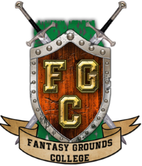
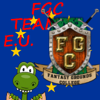

# Fantasy Grounds - Port Forwarding and a "transparent" OpenVPN setup


This document, initially written in June 2019 for FG "Classic", is now being updated \(September 2020\) for :

* **simultaneous** GMs/games through a **single VPN server for FGC/FGU/FGC+FGU**
* **FG "Unity" hosting games in LAN mode**

For these use cases, specific sections have been added before appendixes.


**FGU = Fantasy Grounds Unity** vs. **FGC = Fantasy Grounds Classic :**

With **FGU**, hosting a game in **"Cloud" mode** should be **ok for all GMs**, whatever their specific network situation, **without needing any kind of VPN**.

However, if for any reason \(platform unavailable, broken Internet routes, privacy concerns, whatever...\) you want to host an **FGU** game in **LAN mode** :

* it is the same kind of networking topology and constraints as FGC
* the **default** protocol/port for **FGU** is **UDP** 1802 while **FGC** uses **TCP** 1802


Most of what I wrote in this document for **FGC = FG "Classic" \(and the TCP protocol\)** can be transposed to **FGU = FG "Unity"** hosting in **LAN mode \(and the UDP protocol\).**



**FGU** game hosting in **CLOUD mode should** be totally straightforward in all networking situations and **not require any kind of port forwarding or VPN** \(except if some countries block traffic to the Unity servers...\)


This document will describe a solution for GMs \(Game Masters\) to publish their Fantasy Grounds virtual table to remote players through an ad-hoc "GM-only" VPN, hosted on a small AWS \(Amazon Web Services\) Linux server.

_**But first...**_

## Do you _really_ need a VPN for  Fantasy Grounds "Classic"  ?


**Most GMs do not need to use a VPN** to successfully share their virtual table for players



**Players generally do not need to use a VPN**


There are however situations where **a VPN may be needed on the GM's side** :

1. **temporary connection from a "public" internet facility** \(hotel room, etc\)
2. country/ISP setup makes a **unique public IPv4 address unavailable**
3. **proper port forwarding not possible** for one \(or more\) router\(s\)
4. **upstream "closed" firewall**


Also : **if you are a player and your GM is using a "closed VPN" offer like Hamachi, you will have to be a member of the same VPN as the GM to join the game.**



This document presents a **"transparent" VPN solution**, where :

* **only the GM** uses the VPN
* the VPN is used to **forward FG traffic only** \(TCP 1802\)
* the **players do not have to install/use any kind of VPN** or custom IP routing software


## More help

To find out about **everything you ever wanted to learn about Fantasy Grounds, and more**, go visit :

###  **Fantasy Grounds College**  

FGC is a fantastic group of FG fans \(GMs and players\) providing voluntary help and training about FG, and can be joined :

* on Discord : [https://discord.gg/Ew6nYyw](https://discord.gg/Ew6nYyw)
* on the website : [https://fantasygroundscollege.net/](https://fantasygroundscollege.net/)
* the Knowledge Base : [https://fgc-kb.fantasygroundscollege.net/](https://fgc-kb.fantasygroundscollege.net/)

###  FGC Team EU Lair at ZeFerby's  :

We are a fan-driven Fantasy Grounds help and gaming place created by FGC offsprings \(especially from EU-like timezones\).  You'll find us on Discord here : [https://discord.gg/6s6WCuZ](https://discord.gg/6s6WCuZ)

### Official  **Fantasy Grounds**  from **SmiteWorks** USA LLC :

* Website and Forums : [https://www.fantasygrounds.com/](https://www.fantasygrounds.com/)
* Discord server : [https://discord.gg/dbuQvgG](https://discord.gg/dbuQvgG)
* Steam discussions : [https://steamcommunity.com/app/252690/discussions/](https://steamcommunity.com/app/252690/discussions/)

