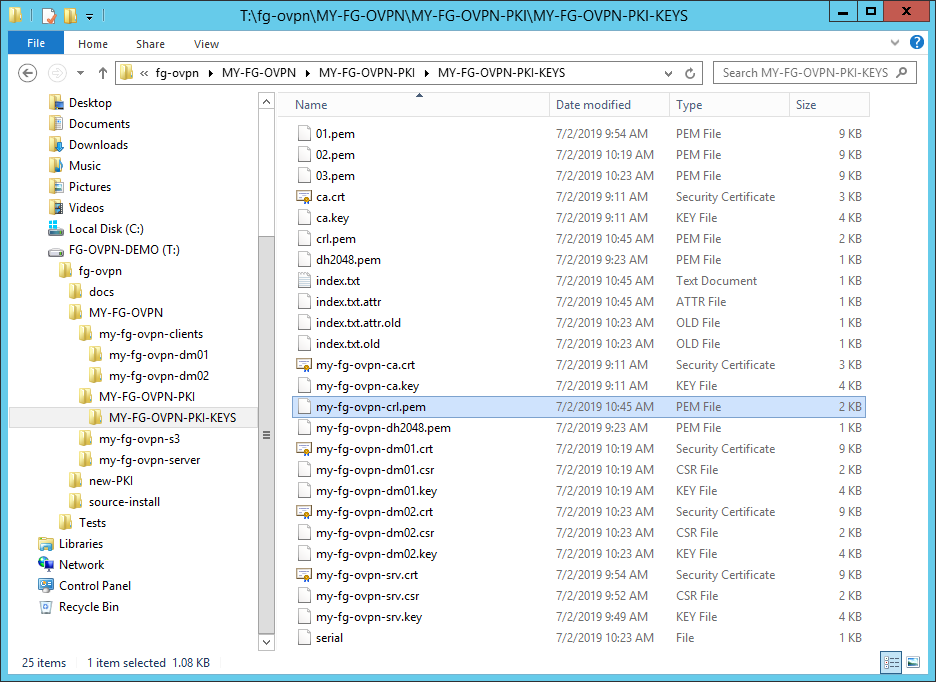

# Internet connection barriers

The last 3 points relate to your Internet connection.


**Most GMs** have a single "Internet router" and **do not have to bother about Barrier 6**


## Barrier 4 👺 : The NAT/PAT frontier on the Internet router

Most home Internet connections are delivered through a single all-in-one device we'll call an "Internet router", which actually does several jobs at once :

* **Modem** : it adapts an electrical or optical signal on your ISP line to and from network traffic on your side \(_depending on installations, this may actually be done by a secondary "adapter box" located just between your Internet router and the ISP line itself_\)
* **WIFI access point** : it enables wireless connection for your devices \(PC/Mac, Tablet, Phone, SmartTV, etc\)
* **Router** : it routes network traffic between your own private "in-home" network space to and from the Internet
* Other roles :
  * **DHCP server** : it assigns private IP addresses to connected devices on your internal network \(plus a minimal set of networking parameters\)
  * **DNS forwarder** : it helps your connected devices getting DNS names \(like [fantasygroundscollege.net](https://fantasygroundscollege.net) or [www.fantasygrounds.com](https://www.fantasygrounds.com)\) resolved into public IP addresses
  * depending on the model, it may also provide **other services** like file or printer sharing, etc...

The critical elements here are the **Router** and **DHCP Server** features of your "Internet router" : 

* when your devices are connected to it, it's **DHCP Server** feature delivers **one PRIVATE IP address to each device** on your home network; _your GM FG machine is one of those_.
* when the "Internet router" is connected to your ISP / the Internet, the **Router** has a **single PUBLIC IP address**
* the **Router** then uses something called NAT \(Network Address Translation\) or more specifically PAT \(Port-Address Translation\) to **"share" it's single public IP** for all your devices communicating through it with the Internet

So **ALL your devices**, when communicating with the Internet via the Router, are seen as the same **single PUBLIC IP address** as the Router itself, and **your FG machine** \(the GM's one\) **is only one of many** such devices "using" the same public IP.

When an incoming communication request comes in from a remote FG player, the Router needs to know specifically where to route that request \(i.e. to your GM FG machine, not to your SmartTV ! 😛 \); otherwise the Router will just ignore the communication request.


#### This is where **Port Forwarding** comes into play !


**You have to** **give the Router a rule to accept TCP 1802 packets coming in on the single public IP from the Internet and to forward them to your GM FG machine \(on its private IP\), still on port TCP 1802**.

This is called a **Port Forwarding rule**.

### Port Forwarding

Setting up port forwarding for FG means you usually have to :

* enter the administration/setup facility of your "Internet router" \(and you probably need the proper administrative username + password for that\)
* Best practice \(may be required for your model\) : **assign a Static Private IP address to your machine** ⚠ _**See the Dynamic/Static Private IP point below**_  ⚠ 
* locate the Port Forwarding features, which may be called by many different names depending on the device brand;  you will generally find them under a "NAT" / "PAT" / "Advanced" section...
* enter a rule for Fantasy Grounds with basically :
  * \(potentially\) a name
  * the public / external port : **TCP 1802** _This is the port on which the Router will "listen" for connection requests incoming from remote FG players_
  * the destination machine : either choose from a list of devices, or enter an IP address _**This must be your GM FG machine \(private IP\) !**_  ⚠ _**See the Dynamic/Static Private IP point below**_  ⚠ 
  * the destination / private / internal port : **TCP 1802** _This is the port of your GM FG machine on which FG listens to incoming player connections_
* for some models you also will have to "Save the configuration"

**As an example**, here is the rule i use at one of my network locations \(my current W7 machine is called AST7NBEF, selected from a dropdown list, and I simply called the rule "FG"\) :

### Dynamic/Static Private IP address


If your model of router records a port forwarding rule target as an IP address you should **assign your GM FG machine a Static Private IP address in the router DHCP section.**

**It is a** 👍 **good practice even if your router does not require it explicitely.**

This way, every time **your GM FG machine** will reconnect to your local "home" network, it **will always have the same Private IP address**.

Otherwise it will get a \(random\) **Dynamic Private IP address** when reconnecting, and after a few hours/days being off-line that new private IP **may not be the same as what you entered in your port forwarding rule**, which would then not work any more... 😩 


As an example, here is the network setup at the same location as above :

And here is the bottom of the page with the static IP reservation part, where you can see I have the private IP 172.30.131.11 reserved for my W7 and it will always get this private IP every time I come to this place :


This has **NOTHING to do with your Public IP**, which can also be either _dynamic or static_ depending on your Internet connection subscription.



A large info repository on many "Internet router" brands/models is available at [https://portforward.com/router.htm](https://portforward.com/router.htm) where you may find more step-by-step instructions for your own specific model. _**Just be wary of all the links inciting you to purchase tools and/or subscriptions there !**_


## Barrier 5 🤔 : "Internet router" integrated firewall

Some "Internet routers" also have a integrated firewall settings that may totally ignore your port forwarding rules, and prevent any incoming connection request.

So be sure to check your **Internet router settings to** 👍 **remove firewalling at least for TCP 1802, used in your FG Port Forwarding Rule, or else...** 👎 


**If :**

* **you have cleared barriers 1 to 5**
* **AND you have only 1 "Internet router" between your local network and the Internet**
* **AND you are not in one of the NO-GO situations,**

**then :**

**You should be OK** 👌 **to host games on Fantasy Grounds !** 😺 **without needing a VPN** 😄 


## Barrier 6 😩 : Cascaded devices with NAT/PAT

Bad news !

**Each and every "layer"** from the most "outer" \(= Internet\) side **has to Port-Forward TCP 1802 to the next "inner" layer** : from router to router until the last one, which must port-forward to the GM FG machine as above.

