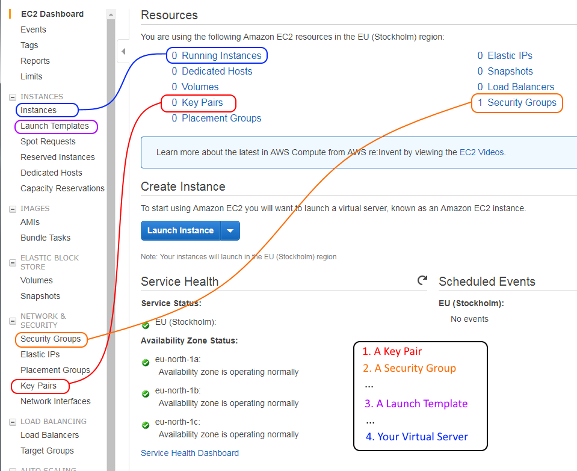

# Step 2 : Create your PKI


Properly creating the PKI is the **fundamental anchor of your setup's security !**


### Duplicate from the `new-PKI`

As first step we'll duplicate the whole contents of our **`new-PKI`** folder into **our own PKI** sub-folder named **`MY-FG-OVPN-PKI`** : select **all files**, then **Copy**, go to the **target folder** then **Paste**



We'll now more or less follow the instructions you can read in the README.txt file, except that :

* **I'll bore you considerably more than the short orignal README** \(_Hi tech guys !_\)
* **we'll adapt to the "autonomous" PKI location**
* **we'll add some safeguarding to the most dangerous command scripts**


### MY-FG-OVPN-PKI-KEYS sub-folder

Let's create a sub-folder into our own PKI folder, to store this particular PKI's "database" of certificates and keys, that we'll call **`MY-FG-OVPN-PKI-KEYS`** :


### Run init-config.bat then rename it

You can double-click **init-config.bat** in **`MY-FG-OVPN-PKI`** to run this command, and that will initialize the **new vars.bat command script file** from a sample file.


The init-config.bat command **should not be reused later on, as it would ERASE the customizations** we are about to do in the vars.bat file.

So we'll **rename init-config.bat** to **DONE-DANGER-init-config.bat**



### Edit vars.bat

We now have to **edit the vars.bat file** for it to suit our requirements :

* we **comment out \(or delete\)** the lines playing with the **PATH** to ensure the commands use the versions of executable binary programs we have in our PKI folder and none other \(lines 7 and 10 below; only line 7 needs editing since line 10 is already commented out with "**`rem`** "\)
* we set **HOME** to the full path of the root folder for our PKI; everything the Easy-RSA commands will do later on will happen from that location : this is the **`T:\fg-ovpn\MY-FG_OVPN\MY_FG_OVPN_PKI`** folder \(line 12 below\)
* we set **KEY\_DIR** to the name of the subfolder where we want our certificates and keys to be stored : this is the **`MY-FG-OVPN-PKI-KEYS`** we created earlier
* we give some default values for our future certificates in the list of **set KEY\_xxxx** commands at the end of the file.


To avoid accidentally keeping a \(wrong\) default value for **2 important fields** of our certificates, we'll put a clear **prompt for action as their default value** :

**KEY\_CN** and **KEY\_NAME**


* we can **keep or delete all the comment lines** \(= lines starting with "**`rem`** "\)


So we edit vars.bat in a text editor \(_Right click + Edit_ opens Windows Notepad which is sufficient for good old **`.bat`** windows-only command files\) as follows.

Supposing you start **from the original content below** \(sample as of OpenVPN v2.4.7\),



```text
@echo off
rem Edit this variable to point to
rem the openssl.cnf file included
rem with easy-rsa.

rem Automatically set PATH to openssl.exe
FOR /F "tokens=2*" %%a IN ('REG QUERY "HKEY_LOCAL_MACHINE\SOFTWARE\OpenVPN"') DO set "PATH=%PATH%;%%b\bin"

rem Alternatively define the PATH to openssl.exe manually
rem set "PATH=%PATH%;C:\Program Files\OpenVPN\bin"

set HOME=%ProgramFiles%\OpenVPN\easy-rsa
set KEY_CONFIG=openssl-1.0.0.cnf

rem Edit this variable to point to
rem your soon-to-be-created key
rem directory.
rem
rem WARNING: clean-all will do
rem a rm -rf on this directory
rem so make sure you define
rem it correctly!
set KEY_DIR=keys

rem Increase this if you
rem are paranoid.  This will slow
rem down TLS negotiation performance
rem as well as the one-time DH parms
rem generation process.
set DH_KEY_SIZE=2048

rem Private key size
set KEY_SIZE=4096

rem These are the default values for fields
rem which will be placed in the certificate.
rem Change these to reflect your site.
rem Don't leave any of these parms blank.

set KEY_COUNTRY=US
set KEY_PROVINCE=CA
set KEY_CITY=SanFrancisco
set KEY_ORG=OpenVPN
set KEY_EMAIL=mail@host.domain
set KEY_CN=changeme
set KEY_NAME=changeme
set KEY_OU=changeme
set PKCS11_MODULE_PATH=changeme
set PKCS11_PIN=1234

```



...then you should **end up with this kind of minimal final result** :


**ALL the other lines** you may want to keep for reference in the **vars.bat** file should be **commented out** with **"rem " as seen above**



_**Of course the HOME full path to your own PKI may be different than mine, as well as your choices for the KEY\_COUNTRY etc... default values at the end**_




```text
@echo off

set HOME=T:\fg-ovpn\MY-FG-OVPN\MY-FG-OVPN-PKI
set KEY_CONFIG=openssl-1.0.0.cnf
set KEY_DIR=MY-FG-OVPN-PKI-KEYS
set DH_KEY_SIZE=2048
set KEY_SIZE=4096

set KEY_COUNTRY=FR
set KEY_PROVINCE=FR
set KEY_CITY=MyCity
set KEY_ORG=MyOrg
set KEY_EMAIL=no-mail@no-domain.com
set KEY_CN=CHANGE-ME-MANDATORILY
set KEY_NAME=CHANGE-ME-MANDATORILY
set KEY_OU=MyOrgUnit
set PKCS11_MODULE_PATH=unused
set PKCS11_PIN=1234

```




### Edit and rename ⚠ clean-all.bat ⚠ 


The **clean-all.bat command script ERASES the whole PKI "database"** including **all certificates and keys**. It **must be used ONLY ONCE to initialize the database and NEVER AGAIN !**


So we'll first edit it to **add these 2 lines between original lines 1 and 2** :

```text
choice /C YN /T 10 /D n /M "This will ERASE THE PKI AT %HOME% ...Still want to do this ??"
IF ERRORLEVEL 2 GOTO End
```

And we'll **add this last line at the end of the file** :

```text
:End
```

The **resulting clean-all.bat** file should be :



```text
@echo off
choice /C YN /T 10 /D n /M "This will ERASE THE PKI AT %HOME% ...Still want to do this ??"
IF ERRORLEVEL 2 GOTO End
rem move to the HOME directory specified in VARS script
cd %HOME%
rem set a temporary KEY_DIR variable
set d=%KEY_DIR%
rem delete the KEY_DIR and any subdirs quietly
rmdir /s /q %d%
rem make a new KEY_DIR
mkdir %d%
rem copy in a fesh index file so we begin with an empty database
copy index.txt.start %d%\index.txt
rem copy in a fresh serial file so we begin generating keys at index 01
copy serial.start %d%\serial.
:End

```



This way, when we run this "killer" command script file, we'll have a **warning and Y/N choice**, with the "No I don't want to kill my own PKI" answer selected by default after 10 seconds...

...and just to be safe, we'll **rename `clean-all.bat` to `NEVER-AGAIN-DANGER-clean-all.bat`** !



_What ? Sorry ? Are you kidding me ? **Did I ever fall into that trap**, instantly killing a PKI that had been used for 3 years with 50+ certificates ? With an out of date backup ?..._

_**OF COURSE NOT !!!**_

_...Well..._~~_maybe once but i don't really remember, you see, so :_~~ _**let's move on !**_



### Going to command line mode


📢 **YOU in the background ! WAKE UP ! This is important !** 📢 



From now on, we'll use a **single command line prompt** window to type all the commands.

We'll **absolutely NOT double-click command files !!!**


_**Last reference to "**_[_**Check that you know/learn**_](step-0-preparation.md#check-that-you-know)_**" in Step 0 !**_

So we open a command line prompt window and we position ourselves in the right **folder for our PKI**. In my demo this is :**`T:\fg-ovpn\MY-FG_OVPN\MY_FG_OVPN_PKI`** 



```text
T:
CD \fg-ovpn\MY-FG_OVPN\MY-FG-OVPN-PKI
```



A quick check to verify this is the right place :



```text
dir
```




Then once we know we have arrived at the right place, **the VERY FIRST COMMAND** we'll type is :



```text
.\vars.bat
```




This will setup the "**environment variables**" that you specified earlier, and these will remain **available for other commands until you close that specific command line prompt window**.



**If you need to open a new command prompt window**, **remember to re-position to the right folder and use ".\vars.bat" command FIRST !**

**Remember that when you come back days or months later to add a new client certificate or revoke an existing one.**

**Try to build up your keyboard "muscle memory" with the following tip :**



The **vars.bat command script can be run multiple times** without any issue.

**Actually, we'll re-run it before every other command in this example.**



### A clean starting point ONCE AND FOR ALL

Let's use **the "killer" command script**, give **the Y answer THIS ONE TIME**, and then **let's forget about it**...

```text
.\vars.bat
.\NEVER-AGAIN-DANGER-clean-all.bat
```

**This deletes any pre-existing data in your PKI keys folder and initializes the PKI "database" :**


### Build the CA Certificate+Key with build-ca.bat

Easy !

```text
.\vars.bat
.\build-ca.bat
```


**Answer the prompts**, just hitting "Enter/Return" to keep default values **EXCEPT FOR Common Name and Name. Use the same simple name withour spaces for the 2 fields.**

Let's call our CA : **my-fg-ovpn-ca**, keeping our good prefixing habit.



This creates the PKI Certificate Authority's own self-signed certificate \(**ca.crt**\) and private key \(**ca.key**\) in the **`MY-FG-OVPN-PKI-KEYS`** sub-folder.


Since we are here within our own PKI, we only have one CA so these simple filenames are fine. But when we'll use our CA certificate elsewhere, many multiple CAs may be involved so :


We'll **copy+paste+rename these 2 files to have unique names :**

* **ca.crt** copied to **my-fg-ovpn-ca.crt**
* **ca.key** copied to **my-fg-ovpn-ca.key**




**Do NOT rename the original files directly, keep uniquely named copies !**



### Build the DH file with build-dh.bat

Easy, but may take a long time depending on your computer !

```text
.\vars.bat
.\build-dh.bat
```


...time passes...finally :



This has generated the [**Diffie-Hellman-Merkel key exchange**](https://en.wikipedia.org/wiki/Diffie%E2%80%93Hellman_key_exchange) parameter file that will be used to initiate encryption sessions.



We'll also keep a **uniquely named copy of dh2048.pem** : **my-fg-ovpn-dh2048.pem**



### Build the OpenVPN Server Certificate+Key with build-key-server.bat

Easy again ! Choose a simple name !


**Answer the prompts**, just hitting "Enter/Return" to keep default values **EXCEPT FOR Common Name and Name. Use the same simple name withour spaces for the 2 fields.**

Let's call our OpenVPN server : **my-fg-ovpn-srv**, keeping our good prefixing habit.


```text
.\vars.bat
.\build-key-server.bat my-fg-ovpn-srv
```

Since our **server should boot up in unattended mode** without anyone to enter a password :


**Do NOT enter a challenge password**



**Answer y for Yes to the last 2 questions :**

* **sign the certificate ?** ==&gt; YES !
* **commit ?** ==&gt; YES !



This creates 3 files in your keys folder, with the name you typed on the command line :

* **my-fg-ovpn-srv.crt** : the server public certificate
* **my-fg-ovpn-srv.key** : the server private key
* **my-fg-ovpn-srv.csr** : the "certificate signing request" used during the process


These files should **already be uniquely named**, so we'll keep them as they are.


### Build 2 clients \(GMs\) Certificate+Key with build-key.bat

Being used to D&D, i already called my clients subfolders my-fg-ovpn-dm01/02, so let's stick to that.

```text
.\vars.bat
.\build-key.bat my-fg-ovpn-dm01
```


**Do the same thing with my-fg-ovpn-dm02...**


You should now have :


### Revoke \(invalidate\) the second GM's certificate

Our next step will be to **initialize a Certificate Revocation List \(CRL\) for our OpenVPN server** to systematically check before authorizing a connection.

This CRL will be your way of ensuring that older certificates, that you may have distributed in the past and whish to invalidate at some point, are really blocked.

But to create that CRL, **we need at least one client certificate to be revoked, so "DM02" is our victim !** 🔫 

```text
.\vars.bat
.\revoke-full my-fg-ovpn-dm02
```


You can see on the above screenshot :

* **why we kept the original ca.crt and ca.key files**
* the Easy-RAS utility checking that a session key negociation initiated on behalf of my-fg-ovpn-dm02 **actually fails because it is revoked, which is what we want !**


**This process** does not delete files : it **marks them as revoked \(= invalid\) in the PKI "database", and they will be included in the next CRL \(Certificate Revocation List\) we'll soon generate.**



**So : R.I.P. my-fg-ovpn-dm02...** ⚰ ****💀 ****☠ ****

_**After all, DM01 was here first, and he's not a sharer...**_




### Create your initial CRL : Certification Revocation List


