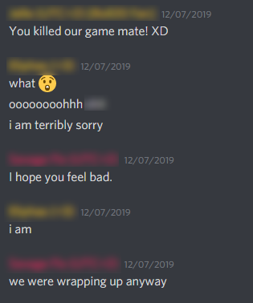
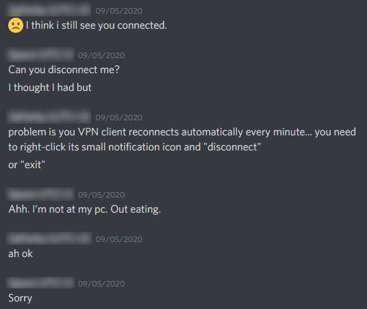

# Lifting the "1 GM at-a-time" restriction

What if you have **multiple GMs that need the VPN to host games** ? For example, you may belong to a community of Fantasy Grounds players and GMs mostly based in "pure IPv6" countries.

There are several ways to manage such situations, that we'll explore below :

* **1-at-a-time /N :** _**Time-sharing**_ a single VPN Server + single GM connection/certificate
* **Nx 1-at-a-time :** Each GM creates his _**own VPN server**_ following this guide
* **1x N-at-a-time :** Single VPN Server + Nx _**GM-dedicated connections/certificates**_


Remember that [**each GM has to check his/her own machine**](../general/gms-machine-barriers.md) for "Barriers 1 to 3"


## **1-at-a-time /N :** _**Time-sharing**_ a single VPN Server + single GM connection/certificate

You share with other GMs the hard work you have already done following this guide :

* you distribute [the same set of OpenVPN parameters and credentials](../local-setup/step-3-prepare-your-openvpn-connection.md#my-fg-ovpn-dm01) to all you GM friends
* each of them [installs OpenVPN client](../local-setup/step-1-install-openvpn-+-easy-rsa-2.md) _**NB:** They do **NOT** need to install EasyRSA2 or setup a PKI, **only OpenVPN itself is required**_
* each of them [installs the set of parameters](../local-setup/step-3-prepare-your-openvpn-connection.md#openvpn-gui) that you supplied

👍 **Pros :**

* lightweight solution
* no technical skills required for other GMs

👎 **Cons :**

* **STILL 1-AT-A-TIME !**
* replacing the certificate requires installing the new set of parameters for all GMs
* **your own availability**, required to start/launch the server and communicate the new Public IP **if it only runs on-demand**, as opposed to 24x7
* **time-sharing organization**, usage planning and timezone errors, colliding time slots - **2 GMs connected at the same time =&gt; broken FG sessions** - one day or another you'll encounter issues like those :

## **Nx 1-at-a-time :**  Each GM creates his own VPN server

This option is self-explanatory...

The main issue here is that some \(most ?\) of the **other GMs may not be as geeky as you are** \(since you made it this far...😉\), and **may be daunted by this solution**.

👍 **Pros :**

* maximum flexibility

👎 **Cons :**

* maximum setup work
* technical skills required for GMs

## **1x N-at-a-time :** Single VPN Server + Nx _**GM-dedicated connections/certificates**_

This option is quite neat as it enables to run multiple simultaneous FG games for several GMs at the same time through the one and only VPN Server you already created, but :


it requires **additional work to setup**, and it is **not 100% transparent for players.**



**It is mostly suitable for a community with several GMs, running mid- to long-term FGC games \(campaigns\)** since the extra complexity is managed up-front, once and for all.


👍 **Pros :**

* **removes the burden of time-sharing organization** The GMs with dedicated connections can _host FGC games at any time_ \(while the VPN server is running\) _without fear of collision_ with other games They can even forget to close their VPN connection without harming other GMs' game sessions...
* **compatible with the original "1-at-a-time" setup, which remains 100% transparent for players** You can have both GM-dedicated specific connections and still maintain the time-shared setup you already created
* **gives more control over security** by having specific connections/certificates per GM

👎 **Cons :**

* it needs you to **dive deeper into the OpenVPN configuration** We'll detail this with step-by-step instructions in next pages
* it requires **GMs and Players** to create and use a **customized shortcut to FGC** \(for ease of use\) to run Fantasy Grounds Classic on a specific TCP port, different than the standard TCP 1802 Creating a specific shortcut to the FG program _should not be an issue_ to play with a specific GM for multiple sessions in an _on-going campaign_; but it could be _awkward for 1-shot games_

_This solution became possible when I finally understood how to run FG Classic on a custom TCP port...  
It **only** took me a bit more than 2 years after starting using the program !..._

